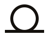

  

  <h1>Lemma</h1>

  

    <strong>거꾸로 만든 인터랙티브 수학 교과서.</strong> 
    질문에서 시작합니다. 수학은 그 다음입니다.
  

  

    <a href="https://lemma.wiki">lemma.wiki</a>
    &nbsp;·&nbsp;
    <a href="./README.md">English</a>
    &nbsp;·&nbsp;
    <a href="./brand/README.md">브랜드 키트</a>
  

---

## 문제

수학 교육은 명확하게, 진단 가능한 방식으로 망가져 있습니다. 세 개의 실패가 쌓여 있습니다.

**1. 정의가 먼저, 동기는 영영 없음.**
학교는 적분 공식을 던져주기 전에 이게 곡선 아래 면적을 구하려고 발명됐다는 사실을 말해주지 않습니다. 학습자는 *절차*를 익히고 *질문*을 놓칩니다. "미적분을 배웠다"는 사람 대부분이 *애초에 누가 미적분을 왜 원했는지*를 설명하지 못합니다. 이건 학습 실패가 아닙니다. 가르침의 실패입니다.

**2. 보는 것은 배우는 것이 아닙니다.**
인터넷에 아름다운 수학 영상이 넘쳐납니다. 영감을 주지만, 실력 형성에는 거의 쓸모가 없습니다. 3Blue1Brown 영상을 다 보고 깨달은 기분이 들지만 그 주제의 문제 한 개도 풀지 못합니다. 수동적인 시각화는 *이해의 환상*을 만들고, 진짜 신경회로 — 연필, 종이, 씨름 — 는 결코 형성되지 않습니다.

**3. 한국어 ↔ 영어 용어 갭은 사보타주입니다.**
이 두 언어 사이에서 수학, ML, CS를 하는 사람은 압니다. "회귀"가 "regression"인 게 자명하지 않고, "행렬식"이 "determinant"인 게 자명하지 않고, "경사하강"이 "gradient descent"인 게 자명하지 않습니다. 가끔 한국어 한 단어가 영어 두 개념에 매핑돼서 어느 쪽인지 모를 때도 있습니다. 논문 읽기는 번역이 됩니다. 협업은 끊깁니다. 아무도 고치지 않습니다, 누구의 것도 아니니까요.

이 셋은 별개의 문제가 아닙니다. 서로를 강화합니다. 자기 학습의 동기를 찾지 못하고, 보기를 행하기로 바꾸지 못하고, 언어 간 용어를 옮기지 못하는 학습자는 그만둡니다. 대부분이 그렇게 합니다.

## 입장

이 실패들을 만들어내는 세 가지 패턴을 거부합니다.

| 표준 방식                    | 우리의 방식                                       |
| ---------------------------- | ------------------------------------------------- |
| 정의 → 예시 → 응용           | **응용 → 직관 → 정의**                            |
| 영상 보고 똑똑해진 기분      | **본 다음 손으로 푼다. 예외 없음.**               |
| 한 언어를 가정 (보통 영어)   | **용어 단위로 이중언어. 호버하면 원어.**          |
| 선형 커리큘럼, 선수과목 강제 | **모듈식 그래프. 어디서나 시작. 필요할 때 채움.** |
| 모두에게 한 가지 제시        | **두 모드: 수학 → 코드, 또는 코드 → 수학**        |
| 동기는 커리어 패스           | **동기는 호기심. "X 되기" 없음.**                 |

각 행은 온라인에서 수학이 보통 가르쳐지는 방식을 의도적으로 뒤집은 것입니다. 우리는 통념이 모든 행에서 틀렸다고 봅니다.

## 교육 철학

다섯 원칙. 협상 불가.

**P1 — 추상보다 응용이 먼저.**
모든 주제는 누군가 실제로 묻는 진짜 질문에서 시작합니다. _왜 3체 문제는 풀 수 없는가? ChatGPT는 다음 단어를 어떻게 고르는가? 카지노는 왜 항상 이기는가?_ 수학은 그 답으로 빌드됩니다. 매혹적인 질문을 찾지 못하면, 그 주제는 가르치지 않습니다.

**P2 — 이해는 시각적으로. 검증은 손으로.**
조작, 애니메이션, 인터랙티브 위젯이 직관을 만듭니다. 그 다음 종이 위의 문제가 직관을 실력으로 바꿉니다. 둘 다 필요합니다. 한쪽만 있는 주제는 출시하지 않습니다. 문제 없는 시각화는 오락입니다. 시각화 없는 문제는 가혹행위입니다.

**P3 — 두 개의 문, 하나의 방.**
모든 개념에 두 개의 진입점. *일반 모드*는 수학 → 코드 (이론은 배웠지만 작동하는 모습을 보고 싶은 사람용). *코딩 모드*는 코드 → 수학 (기초를 건너뛰었거나 잊어버린 프로그래머용). 도착지 동일, 문제 세트 동일. 진입로만 다름.

**P4 — 순차적이지 않고 모듈식.**
1단계를 끝내야 2단계로 갈 수 있는 구조 없습니다. 모든 주제는 명시적 의존성을 가진 그래프의 노드입니다. 모르는 선수개념을 만나면 링크를 누르고, 갭을 채우고, 돌아옵니다. 시스템은 깊이를 _필요할 때_ 강제합니다. 미리 강제하지 않습니다.

**P5 — 용어 단위의 이중언어. 지식의 빈틈 없음.**
한국어와 영어가 모두 일급 시민입니다. 모든 기술 용어에 호버로 상대 언어가 표시됩니다. 우리는 _번역된_ 사이트가 아닙니다. 우리는 _용어 갭 자체를 학습 표면으로 다루는_ 사이트입니다.

같은 원칙이 *개념*에도 적용됩니다. 페이지는 방이고, 학습자는 그 방을 떠나서 찾아볼 필요가 없어야 합니다. 고등학교 졸업 수준의 일반 상식을 넘는 모든 것에는 짧은 인라인 설명이나 용어집 백링크가 붙습니다. 판단 기준은 "고등학교를 막 마친 똑똑한 18세가 여기서 막힐까?" 막힌다 — 링크합니다. 한 줄로 설명할 수 없다 — 아직 충분히 이해하지 못한 것입니다. 대상은 18세 이상, 기술적 호기심이 있되 특정 분야의 자격증을 가진 사람이 아닙니다.

## 시스템

세 개의 층. 각각 한 가지를 합니다.

**Applications — _진입점._**
구체적이고, 특정하고, 보통 재미있습니다. 각 application은 자체 완결입니다. 무엇을 만드는지, 왜 중요한지, 필요한 수학, 작동시키는 코드, 이해했음을 증명하는 문제. application은 개관이 아닙니다. 모든 application은 작동하는 결과물을 만듭니다.

**Modules — _공유되는 수학._**
벡터, 미분, 분포, 로그. 이건 커리큘럼이 아닙니다. application들이 *소비하는 도구*입니다. 같은 "벡터" 모듈이 그래픽(위치), 물리(속도), ML(특징), 금융(포트폴리오)에 쓰입니다. 한 번 잘 만들고, 어디서나 재사용.

**Glossary — _사전._**
짧고, 건조하고, 망라적. 한 개념당 한 항목. 무자비하게 상호참조됨. 양 언어 항상 연결. 사전은 의도적으로 재미없습니다. 다른 모든 것을 떠받치는 골조니까요.

## 네 개의 기둥

모든 application은 네 가지 테마 중 하나에 속합니다. 각 테마는 현실에 대한 다른 질문을 갖고 있습니다.

| 기둥        | 묻는다                                | 드러낸다                     |
| ----------- | ------------------------------------- | ---------------------------- |
| **그래픽**  | 공간은 어떻게 기술되는가?             | 선형대수, 기하, 빛           |
| **물리**    | 시간 속에서 변화는 어떻게 일어나는가? | 미적분, 미분방정식, 보존법칙 |
| **ML / DL** | 데이터에서 어떻게 배우는가?           | 최적화, 확률, 그래디언트     |
| **금융**    | 불확실성 속에서 어떻게 결정하는가?    | 확률, 통계, 리스크           |

가장 기본적인 개념들 — 벡터, 미분, 분포, 로그 — 은 네 곳 모두에 등장합니다. 이게 설계의 핵심입니다. 수학은 하나입니다. application이 어떤 얼굴을 먼저 보여줄지를 정할 뿐.

다섯 번째 기둥을 더해 포괄적으로 보이게 하지 않습니다. 넷이 예산입니다.

## 채널

Lemma는 웹사이트입니다. 동시에 그 웹사이트가 렌더링하는 *코퍼스*이기도 합니다. 같은 글이 lemma.wiki 바깥의 독자에게도 닿도록, 세 가지 다른 표면을 더 갖춥니다.

**MCP 서버 (`@lemmawiki/mcp`)** — _AI가 호출할 수 있는 코퍼스._
[Model Context Protocol](https://modelcontextprotocol.io) 서버가 [`apps/mcp/`](./apps/mcp/)에서 출시됩니다. Claude Desktop, Cursor, 또는 MCP 호환 호스트에 등록하면, LLM이 Lemma의 모듈·응용·여정·용어·실행 가능한 공식을 *직접 조회*해 *근거 있는 답*을 만듭니다. 일곱 개의 도구 (`lemma_search`, `lemma_get_module`, `lemma_get_journey`, …) 가 Lemma의 _실제 prose_ — 이중언어, 인용 가능 — 를 돌려주므로, 모델은 평균낸 인터넷이 아니라 _우리에게서_ 답합니다. 수학은 LLM이 가장 자주 환각하는 도메인. 작고 의견 있고 매니페스토 바를 통과한 코퍼스가 현대 RAG가 원하는 grounding의 정확한 모양입니다. 자세한 내용은 [MCP README](./apps/mcp/README.md).

**Seed — 단일 파일 오프라인 내보내기.**
일반 빌드 후 `pnpm --filter lemma-web build:seeds` 실행하면 `apps/web/dist-seeds/`에 페이지마다 자기완결된 `.html`이 한 장씩 생깁니다. 이메일 첨부, 아카이브, USB로 2010년대 노트북에, 비행기에서 읽기. CSS, 스크립트, 위젯 청크, 심지어 React 런타임까지 모두 `data:` URI로 인라인 — `file://` 프로토콜에서 네트워크 없이 작동. seed 한 장 평균 ~6.5MB. 거래: 바이트 vs 휴대성. _서버에 의존하는 지식은 너의 것이 아닙니다._

**Listen — 브라우저 네이티브 TTS.**
모든 페이지 kicker 옆에 작은 `▶ listen` (한국어판은 `▶ 듣기`) 칩이 떠 있습니다. 클릭하면 브라우저가 prose를 _문장 단위로_ 읽어주고 — 일시정지/이어서/정지 컨트롤. v1은 `window.speechSynthesis`라서 Apple/Google/Microsoft가 이미 독자의 컴퓨터에 깔아둔 voice를 그대로 씁니다. API 키 없음, 오디오 자산 없음, seed 옆에서 오프라인으로도 작동. v2에서는 스튜디오 quality voice + 위젯 상태의 음성 묘사로 갈아탈 예정.

## 무엇이 _아닌가_

거부하는 것을 명시합니다. 거부는 포함만큼이나 프로젝트를 정의하니까요.

- **커리큘럼이 아닙니다.** "6개월 안에 ML 엔지니어 되기" 없습니다. 커리어 패스 프레이밍은 학습자에게 아첨하고 수학을 서두릅니다. 거부합니다.
- **영상 사이트가 아닙니다.** 애니메이션은 존재합니다. 문제를 위해 존재하지, 그 반대가 아닙니다. 애니메이션 없이 배울 수 있는 주제라면, 애니메이션 없습니다.
- **개관 사이트가 아닙니다.** 좁은 곳에서 깊이를, 모든 곳에서 폭이 아닙니다. 이 프로젝트의 대부분의 시간 동안, 수학의 대부분이 빠져 있을 겁니다. 그렇게 말할 겁니다.
- **선생님, 교과서, 대학의 대체재가 아닙니다.** 우리는 세 번째 장소입니다 — 수업 후, 혼자 앉아서, 진짜로 이해해보려 할 때.
- **언어 중립이 아닙니다.** 한쪽을 택합니다. 한국어와 영어의 이중언어, 그리고 그 사이의 갭이 이 프로젝트의 중심 기능입니다.

## 현재 상태

시스템 검증 단계. 2026년 5월 현재, Lemma에는 응용 16개 — 각 기둥마다 네 개 — 와 공유 모듈 8개가 있고, 모듈 8개 모두 응용 둘 이상에 쓰입니다. 모듈 그래프는 약속이 아니라 *셀 수 있는 사실*입니다. [lemma.wiki/ko/graph](https://lemma.wiki/ko/graph)에 그려져 있습니다.

한동안 매니페스토가 코드보다 앞서 있었습니다. 지금은 *영역*이 아니라 *형태*까지만 보여줍니다 — 수학의 대부분은 여전히 비어 있습니다. 하지만 핵심 약속 — 추상보다 응용, 시각적 직관과 손풀이, 두 모드 (수학 → 코드, 코드 → 수학), 모듈 그래프, 용어 단위의 이중언어 백필 — 은 이제 작동하는 예시를 가집니다.

이 매니페스토가 공감된다면, 지금 가장 유용한 기여는 코드가 아닙니다 — 이 매니페스토 자체에 도전하는 것입니다. 이슈를 여세요. 무엇이 틀렸는지, 무엇이 빠졌는지, 무엇이 너무 무른지 말해주세요.

## 기여하기

기준은 단 하나입니다.
_호기심 있는 학습자가 이전엔 이해하지 못한 것을 이해하게 만드는가?_

예 — 들어옵니다.
아니오 — 아무리 다듬어졌어도 들어오지 않습니다.

올바르지만 죽어 있는 콘텐츠는 받지 않습니다. 흥미롭지만 비어 있는 콘텐츠도 받지 않습니다. 둘 다이거나, 아무것도 아니거나.

## 라이선스

**콘텐츠** (글, 다이어그램, 문제, 번역): [CC BY 4.0](https://creativecommons.org/licenses/by/4.0/)
**코드** (위젯, 인프라, 도구): [MIT](https://opensource.org/licenses/MIT)

둘 다 관대합니다. 퍼지는 것이 목적이니까요.
